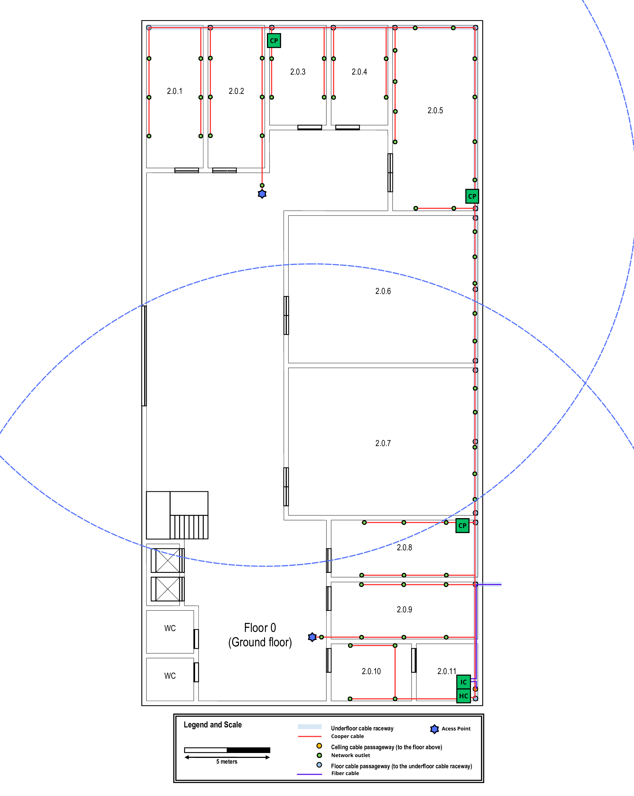
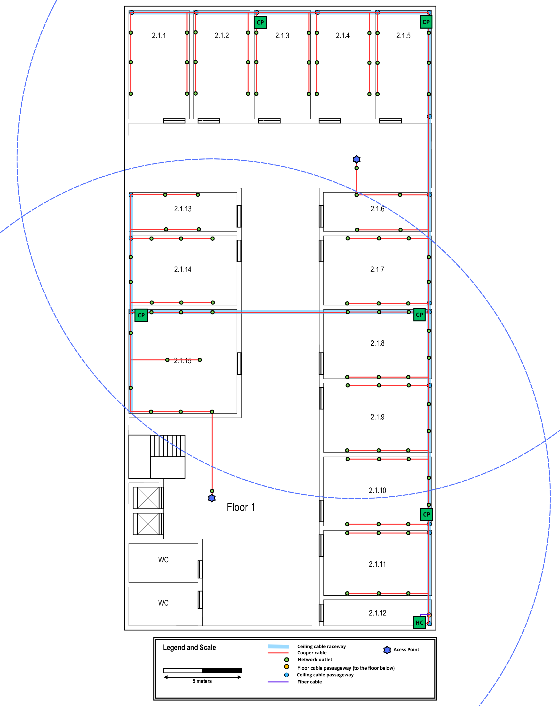

## BUILDING 2 INFORMATION
- The building 2 horizontal
dimensions are, approximately, 40 x 20 meters.
- Both floors of this building require full wireless LAN coverage (Wi-Fi).

### FLOOR 0 ###
- The ground floor has an underfloor cable raceway connected to the external technical ditch. Access to
the underfloor cable raceway is available at points marked over the plan at the image below. The ceiling
height on this floor is four meters.
- Rooms 2.0.6 and 2.0.7 have a special use and the only network outlets required are along the underfloor
cable raceway, five outlets in each room.
- Room 2.0.11 is a storage area and may be used to house a cross-connect, no network outlets are required
there, and the same applies to the restrooms, the entrance hall, and other shared areas. Elsewhere, the
standard number of network outlets per area ratio is to be enforced.

| **Room**  | **Width** (m) | **Length** (m) | **Area** (m²) | **N. Outlets** |
|:---------:|:-------------:|:--------------:|:-------------:|:--------------:|
|   2.0.1   |     3,35      |      8,40      |     28,14     |       6        |
|   2.0.2   |     3,35      |      8,40      |     28,14     |       6        |
|   2.0.3   |     5,00      |      5,90      |     19,77     |       4        |
|   2.0.4   |     5,00      |      5,90      |     19,77     |       4        |
|   2.0.5   |     5,00      |     10,90      |     54,50     |       12       |
|   2.0.6   |     11,15     |      8,7       |     97,01     |       5        |
|   2.0.7   |     11,15     |      8,7       |     97,01     |       5        |
|   2.0.8   |     8,70      |      3,35      |     29,15     |       6        |
|   2.0.9   |     8,70      |      3,35      |     29,15     |       6        |
|  2.0.10   |     4,80      |      3,35      |     16,08     |       4        |
|  2.0.11   |     3,65      |      3,35      |     12,23     |       0        |
|  **AP**   |       -       |       -        |       -       |       2        |
| **Total** |       -       |       -        |       -       |       60       |

### FLOOR 1 ###
- The ceiling height on this floor is three meters, however there is a removable dropped ceiling, placed 2.5
meters from the ground, covering the entire floor. The space over the dropped ceiling is perfect to install
cable raceways. 
- Room 2.1.12 is a storage area and may be used to house a cross-connect, no network
outlets are required there, and the same goes for restrooms, halls, and corridors. For the other rooms,
the standard number of network outlets per area ratio should be applied.

| **Room**  | **Width** (m) | **Length** (m) | **Area** (m²) | **N. Outlets** |
|:---------:|:-------------:|:--------------:|:-------------:|:--------------:|
|   2.1.1   |     3,90      |      7,00      |     27,30     |       6        |
|   2.1.2   |     3,65      |      7,00      |     25,55     |       6        |
|   2.1.3   |     3,65      |      7,00      |     25,55     |       6        |
|   2.1.4   |     3,65      |      7,00      |     25,55     |       6        |
|   2.1.5   |     3,65      |      7,00      |     25,55     |       6        |
|   2.1.6   |     6,95      |      2,55      |     17,72     |       4        |
|   2.1.7   |     6,95      |      4,50      |     31,28     |       8        |
|   2.1.8   |     6,95      |      4,50      |     31,28     |       8        |
|   2.1.9   |     6,95      |      4,50      |     31,28     |       8        |
|  2.1.10   |     6,95      |      4,50      |     31,28     |       8        |
|  2.1.11   |     6,95      |      4,20      |     29,19     |       6        |
|  2.1.12   |     6,95      |      1,70      |     11,82     |       0        |
|  2.1.13   |     6,95      |      2,55      |     17,72     |       4        |
|  2.1.14   |     6,95      |      4,50      |     31,28     |       8        |
|  2.1.15   |     6,95      |      6,70      |     46,57     |       10       |
|  **AP**   |       -       |       -        |       -       |       2        |
| **Total** |       -       |       -        |       -       |       96       |

### OUTLETS ###
For the calculations regarding the number of network outlets for each room, it was based on 
the Structured Cabling Standard. According to this standard, each work area must have at least two outlets, and it also recommends two outlets for every 10 square meters of space.

For example:
- A room between 10 m² and 20 m² should have 4 outlets.
- A room between 20 m² and 30 m² should have 6 outlets.

The room measurements were taken using https://eleif.net/photomeasure.

---
## BUILDING 2 CABLE SYSTEM

- Each floor has two access points, each with a 25m range (radius). The APs are placed in 
strategic locations to avoid overlap between floors and are connected to a ceiling outlet. 
Also, different channels will be used to avoid interference.
- The distance between two network outlets is less than 3 meters to improve accessibility.
- As recommended in the project description, cross-connects are located in the storage area.
- Cable pathways were designed to minimize cable length, optimizing network performance and reducing material costs.
- A cable raceway was installed in the dropped ceiling on Floor 1, as recommended in the project description, ensuring a clean and organized cabling infrastructure.

### Enclosed Rack (Cabinet) for Consolidation Points - Total 6U

- Cooper Patch Panel (CAT7, 24 ports) - 1U
- Consolidation Point (24 ports) - 1U
- Free Space for Future expansion - 2U (additional 100% over dimensioning)

Commercially available telecommunications enclosures start at 6U, so we will use one of
those.

## FLOOR 0 ##

### Enclosed Rack (Cabinet) - Total 15U

- IC Fiber Patch Panel (Multimode, 12 Ports) - 1U
- IC Cooper Patch Panel (CAT7, 24 ports) - 1U
- IC Switch (24 ports) - 1U
- HC Fiber Patch Panel (Multimode, 12 Ports) - 1U
- HC Cooper Patch Panel (CAT7, 24 ports) - 1U
- HC Switch (24 ports) - 1U
- UPS - 1U
- Free Space for Future expansion - 7U (additional 100% over dimensioning)

Commercially available size above 14U is usually 15U, so we will use one.

### Cooper Cable CAT7 Calculations for Floor 0

- **CP -> 2.0.1/ 2.0.2/ 2.0.3:**
  16,6 * 6 + 13 * 6 + 7,2 * 4 = 206,4m
- **CP -> 2.0.4/ 2.0.5:**
  24,9 * 4 + 20,9 * 12 = 350,4m
- **CP -> 2.0.6/ 2.0.7/ 2.0.8:**
  17 * 5 + 7,9 * 5 + 9,8 * 6 = 183,3m
- **HC -> 2.0.9/ 2.0.10:**
  16,4 * 6 + 9,4 * 4 = 136,0m
- **HC -> CP:**
  10,3 + 29 + 52 = 91,3m
- **CP -> AP:**
  10,1 + 16,1 = 26,2m

**TOTAL:** 993,6m

## FLOOR 1 ##

### Enclosed Rack (Cabinet) - Total 12U

- HC Fiber Patch Panel (Multimode, 12 Ports) - 1U
- HC Cooper Patch Panel (CAT7, 24 ports) - 1U
- HC Switch (24 ports) - 1U
- UPS - 1U
- Free Space for Future expansion - 4U (additional 100% over dimensioning)

Commercially available size above 8U is usually 12U, so we will use one.

### Cooper Cable CAT7 Calculations for Floor 1

- **CP -> 2.1.1/ 2.1.2/ 2.1.3:**
  16,8 * 6 + 12,5 * 6 + 8,5 * 6 = 226,8m
- **CP -> 2.1.4/ 2.1.5:**
  15,8 * 6 + 8,6 * 6 = 146,4m
- **CP -> 2.1.6/ 2.1.7/ 2.1.8:**
  14,3 * 4 + 10 * 8 + 9,3 * 8 = 211,6m
- **CP -> 2.1.9/ 2.1.10:**
  17,2 * 8 + 8,3 * 8 = 204,0m
- **HC -> 2.1.11:**
  14,9 * 6 = 89,4m
- **CP -> 2.1.13/ 2.1.14/ 2.1.15:**
  14,1 * 4 + 13,9 * 8 + 11,7 * 10 = 284,6m
- **HC -> CP:**
  6,5 + 20 + 39,1 + 38 + 50,2 = 153,6m
- **CP -> AP:**
  15,2 + 16,9 = 32,1m

**TOTAL:** 1348,5m

---
## INVENTORY

|                **ITEM**                 | **FLOOR 0** | **FLOOR 1** |     **TOTAL**     |
|:---------------------------------------:|:-----------:|:-----------:|:-----------------:|
|           Cooper Cable (CAT7)           |   993.6m    |   1348.5m   |      2342.1m      |
|     Optical Fiber Cable (Multimode)     |     2m      |     15m     |        17m        |
|          Network Outlet (RJ45)          |     60      |     96      |        156        |
| Fiber Patch Panel (Multimode, 12 Ports) |      2      |      1      |         3         |
|   Cooper Patch Panel (CAT7, 24 Ports)   |      5      |      6      |        11         |
|        Hybrid Switch (24 Ports)         |      2      |      1      |         3         |
|                   UPS                   |      1      |      1      |         2         |
|        Access Point (25m radius)        |      2      |      2      |         4         |
|     Consolidation Point (24 Ports)      |      3      |      5      |         8         |
|           Enclosed Rack (15U)           |      1      |      0      |         1         |
|           Enclosed Rack (12U)           |      0      |      1      |         1         |
|           Enclosed Rack (6U)            |      3      |      5      |         8         |
|      Cooper CAT7 Patch Cord (0.5m)      |     120     |     144     | 264 + 4 (for APs) |
|   Fiber (Multimode) Patch Cord (0.5m)   |     24      |     12      |        36         |
|       Cooper CAT7 Patch Cord (5m)       |     58      |     94      |        152        |
_*_ Campus Backbone Optical Fiber Cable (Multimode) not included in this Inventory.

