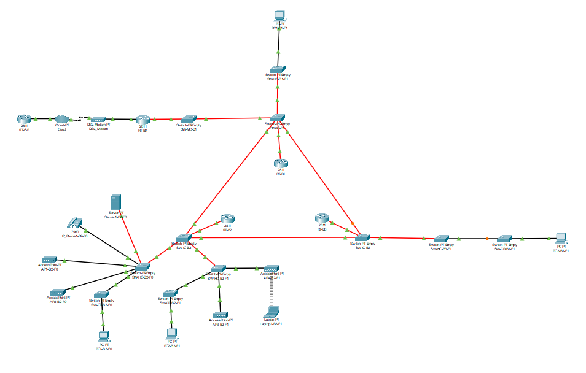

## BUILDING 2 INFORMATION
- End user outlets on the ground floor: 100 nodes
- End user outlets on floor one: 110 nodes
- Wi-Fi network: 200 nodes
- DMZ (Servers, administration workstations, and network infrastructure devices): 60 nodes
- VoIP (IP-phones): 120 nodes

## HARDWARE BUILDING 2 ##

| Hardware ID     | Name                       |
|-----------------|----------------------------|
| RT-B2           | Router                     |
| SW-IC-B2        | Intermediate Cross-connect |
| SW-HC-B2-F0     | Horizontal Cross-connect   |
| SW-HC-B2-F1     | Horizontal Cross-connect   |
| SW-CP-B2-F0     | Consolidation Point        |
| SW-CP-B2-F1     | Consolidation Point        |
| AP1-B2-F0       | Access Point               |
| AP2-B2-F0       | Access Point               |
| AP3-B2-F1       | Access Point               |
| AP4-B2-F1       | Access Point               |
| Server1-B2-F0   | Server                     |
| IP_Phone1-B2-F0 | Phone                      |
| PC1-B2-F0       | PC                         |
| PC2-B2-F1       | PC                         |
| Laptop1-B2-F1   | Laptop                     |

## VLANs BUILDING 2 ##

- **BUILDING 2 NETWORK:** 10.24.36.0/22

| VLAN ID | VLAN Name |     Network      |   Host Min   |   Host Max   |  Broadcast   |
|:-------:|:---------:|:----------------:|:------------:|:------------:|:------------:|
|   396   |   B2-F0   |  10.24.38.0 /25  |  10.24.38.1  | 10.24.38.126 | 10.24.38.127 |
|   397   |   B2-F1   | 10.24.37.128 /25 | 10.24.37.129 | 10.24.37.254 | 10.24.37.255 |
|   398   |  B2-WIFI  |  10.24.36.0 /24  |  10.24.36.1  | 10.24.36.254 | 10.24.36.255 |
|   399   |  B2-DMZ   | 10.24.38.128 /26 | 10.24.38.129 | 10.24.38.190 | 10.24.38.191 |
|   400   |  B2-VoIP  |  10.24.37.0 /25  |  10.24.37.1  | 10.24.37.126 | 10.24.37.127 |

## BUILDING 2 SIMULATION ##

