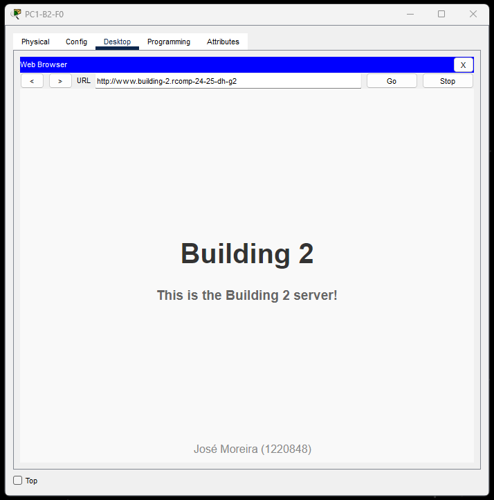
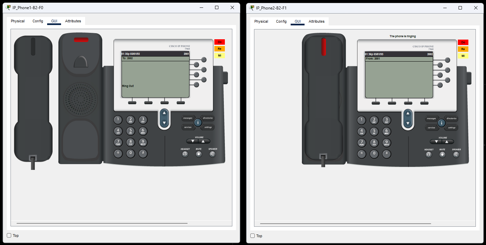
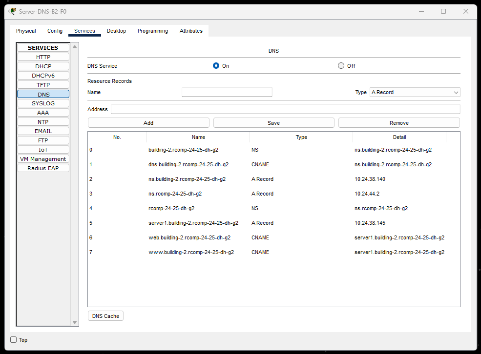

# BUILDING 2 INFORMATION

## 1. OSPF dynamic routing

- Existing static routing tables on building 2 were erased.
### **Building 2 OSPF**:
  ```
  router ospf 1
    router-id 10.24.44.3
    network 10.24.44.0 0.0.0.255 area 0
    network 10.24.36.0 0.0.3.255 area 2
  ```

## 2. HTTP servers

- **Server-HTTP-B2-F0:** `10.24.38.145 /26`

### **Home Page for Building 2**:




## 3. DHCPv4 service

### Excluded Addresses
```
ip dhcp excluded-address 10.24.38.1
ip dhcp excluded-address 10.24.37.129
ip dhcp excluded-address 10.24.36.1
ip dhcp excluded-address 10.24.38.129 10.24.38.190
ip dhcp excluded-address 10.24.37.1
```

### DHCP Pools

- **Floor 0 (VLAN 396):**
    ```
    ip dhcp pool b2-f0
        default-router 10.24.38.1
        network 10.24.38.0 255.255.255.128
        dns-server 10.24.38.140
        domain-name building-2.rcomp-24-25-dh-g2
    exit
    ```
  
- **Floor 1 (VLAN 397):**
    ```
    ip dhcp pool b2-f1
        default-router 10.24.37.129
        network 10.24.37.128 255.255.255.128
        dns-server 10.24.38.140
        domain-name building-2.rcomp-24-25-dh-g2
    exit
    ```
  
- **Wi-Fi (VLAN 398):**
    ```
    ip dhcp pool b2-wifi
        default-router 10.24.36.1
        network 10.24.36.0 255.255.255.0
        dns-server 10.24.38.140
        domain-name building-2.rcomp-24-25-dh-g2
    exit
    ```
  
- **DMZ (VLAN 399):** 
  - **no DHCP pool** (all addresses static)
  

- **VoIP (VLAN 400):**
    ```
    ip dhcp pool b2-voip
        default-router 10.24.37.1
        network 10.24.37.0 255.255.255.128
        dns-server 10.24.38.140
        domain-name building-2.rcomp-24-25-dh-g2
        option 150 ip 10.24.37.1
    exit
    ```


## 4. VoIP service

### Telephony service

- Switches connected to IP Phones configuration
    ```
    switchport mode access
    switchport voice vlan 400
    no switchport access vlan
    ```

- Automatic phone registration and directory number assignment
    ```
    telephony-service
        auto-reg-ephone
        ip source-address 10.24.37.1 port 2000
        max-ephones 20
        max-dn 20
        auto assign 11 to 20
    exit
    
    ephone-dn 1
        number 2001
    exit
    
    ephone-dn 2
        number 2002
    exit
    ```

### Call Forwarding

- Building 1 (extensions 1...)
    ```
    dial-peer voice 1 voip
        destination-pattern 1...
        session target ipv4:10.24.44.2
    exit
    ```
- Building 2 (extensions 2...)
    ```
    dial-peer voice 2 voip
        destination-pattern 2...
        session target ipv4:10.24.44.3
    exit
    ```
- Building 3 (extensions 3...)
    ```
    dial-peer voice 3 voip
        destination-pattern 3...
        session target ipv4:10.24.44.4
    exit
    ```

### **Calling IP_Phone2 (2002) with IP_Phone1 (2001)**:




## 5. DNS

- **Server-DNS-B2-F0:** `10.24.38.140 /26`
- **DNS Domain Name:** `rcomp-24-25-dh-g2`
- **DNS Local Domain Name:** `building-2.rcomp-24-25-dh-g2`

### **DNS Records for Building 2**:



## 6. NAT (Network Address Translation)

### Interface configuration
```
interface FastEthernet1/0.396
    ip nat inside
    exit
interface FastEthernet1/0.397
    ip nat inside
    exit
interface FastEthernet1/0.398
    ip nat inside
    exit
interface FastEthernet1/0.399
    ip nat inside
    exit
interface FastEthernet1/0.400
    ip nat inside
    exit
    
interface FastEthernet1/0.390
    ip nat outside
    exit
```

## Redirection

```bash
# Redirect HTTP/HTTPS requests to our internal HTTPS server
ip nat inside source static tcp 10.24.38.140 80 10.24.44.3 80
ip nat inside source static tcp 10.80.163.35 443 10.24.44.3 443

# Redirect DNS requests to our internal DNS server
ip nat inside source static tcp 10.24.38.140 53 10.24.44.3 53
ip nat inside source static udp 10.24.38.140 53 10.24.44.3 53

```

## 7. Static Firewall (ACLs)

// TODO

