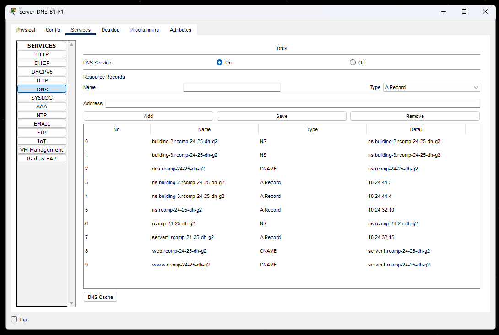

# BUILDING 1 INFORMATION

## 1. OSPF dynamic routing

* Existing static routing tables on building 1 were erased.

### **Building 1 OSPF**:

```
router ospf 1
  router-id 10.24.44.2
  network 10.24.44.0 0.0.0.255 area 0
  network 10.24.32.0 0.0.1.255 area 1
```

## 2. HTTP servers

* **Server-HTTP-B1-F0:** `10.24.32.10 /25`

### **Home Page for Building 1**:


## 3. DHCPv4 service

### Excluded Addresses

```
ip dhcp excluded-address 10.24.33.193
ip dhcp excluded-address 10.24.33.129
ip dhcp excluded-address 10.24.32.129
ip dhcp excluded-address 10.24.32.1 10.24.32.126
ip dhcp excluded-address 10.24.33.1
```

### DHCP Pools

* **Floor 0 (VLAN 391):**

  ```
  ip dhcp pool b1-f0
      default-router 10.24.33.193
      network 10.24.33.192 255.255.255.192
      dns-server 10.24.32.10
      domain-name building-1.rcomp-24-25-cc-gn
  exit
  ```

* **Floor 1 (VLAN 392):**

  ```
  ip dhcp pool b1-f1
      default-router 10.24.33.129
      network 10.24.33.128 255.255.255.192
      dns-server 10.24.32.10
      domain-name building-1.rcomp-24-25-cc-gn
  exit
  ```

* **Wi-Fi (VLAN 393):**

  ```
  ip dhcp pool b1-wifi
      default-router 10.24.32.129
      network 10.24.32.128 255.255.255.128
      dns-server 10.24.32.10
      domain-name building-1.rcomp-24-25-cc-gn
  exit
  ```

* **DMZ (VLAN 394):**

    * **no DHCP pool** (all addresses static)

* **VoIP (VLAN 395):**

  ```
  ip dhcp pool b1-voip
      default-router 10.24.33.1
      network 10.24.33.0 255.255.255.128
      dns-server 10.24.32.10
      domain-name building-1.rcomp-24-25-cc-gn
      option 150 ip 10.24.33.1
  exit
  ```

## 4. VoIP service

### Telephony service

* Switches connected to IP Phones configuration

  ```
  switchport mode access
  switchport voice vlan 395
  no switchport access vlan
  ```

* Automatic phone registration and directory number assignment

  ```
  telephony-service
      auto-reg-ephone
      ip source-address 10.24.33.1 port 2000
      max-ephones 20
      max-dn 20
      auto assign 11 to 20
  exit

  ephone-dn 1
      number 1001
  exit

  ephone-dn 2
      number 1002
  exit
  ```

### Call Forwarding

* Building 1 (extensions 1...)

  ```
  dial-peer voice 1 voip
      destination-pattern 1...
      session target ipv4:10.24.44.2
  exit
  ```
* Building 2 (extensions 2...)

  ```
  dial-peer voice 2 voip
      destination-pattern 2...
      session target ipv4:10.24.44.3
  exit
  ```
* Building 3 (extensions 3...)

  ```
  dial-peer voice 3 voip
      destination-pattern 3...
      session target ipv4:10.24.44.4
  exit
  ```

### **Calling IP\_Phone2 (1002) with IP\_Phone1 (1001)**:


## 5. DNS

* **Server-DNS-B1-F0:** `10.24.32.10 /25`
* **DNS Domain Name:** `rcomp-24-25-cc-gn`
* **DNS Local Domain Name:** `building-1.rcomp-24-25-cc-gn`

### **DNS Records for Building 1**:



## 6. NAT (Network Address Translation)

### Interface configuration

```
interface FastEthernet1/0.391
    ip nat inside
    exit
interface FastEthernet1/0.392
    ip nat inside
    exit
interface FastEthernet1/0.393
    ip nat inside
    exit
interface FastEthernet1/0.394
    ip nat inside
    exit
interface FastEthernet1/0.395
    ip nat inside
    exit

interface FastEthernet1/0.390
    ip nat outside
    exit
```

## Redirection

```bash
# Redirect HTTP/HTTPS requests to our internal HTTPS server
ip nat inside source static tcp 10.24.32.10 80 10.24.44.2 80
ip nat inside source static tcp 10.24.32.10 443 10.24.44.2 443

# Redirect DNS requests to our internal DNS server
ip nat inside source static tcp 10.24.32.10 53 10.24.44.2 53
ip nat inside source static udp 10.24.32.10 53 10.24.44.2 53
```

## 7. Static Firewall (ACLs)

// TODO
